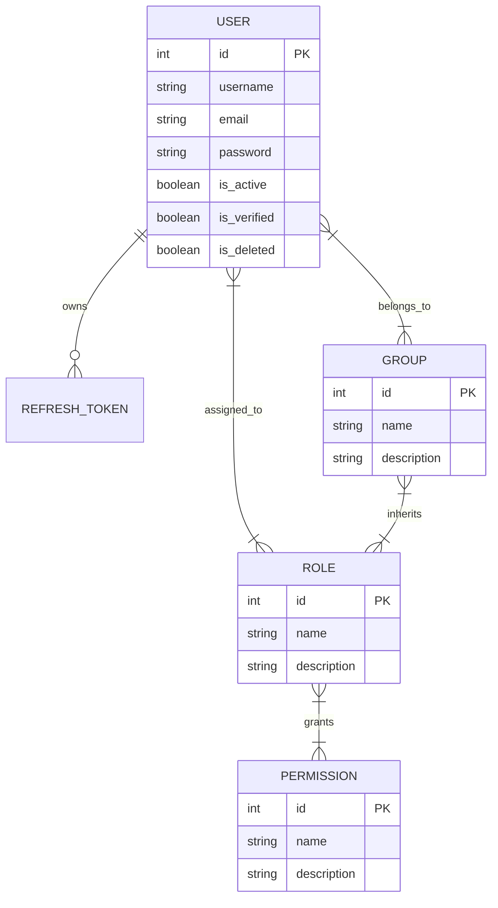

# Users Module — Enterprise Identity, Authentication & RBAC Service

[](https://fastapi.tiangolo.com/)
[](https://www.python.org/)
[](https://www.postgresql.org/)
[](https://www.sqlalchemy.org/)
[](https://www.docker.com/)

A production-grade, asynchronous **User Management, Authentication, and Authorization (RBAC)** microservice built with **FastAPI**, **SQLAlchemy 2.0 (asyncpg)**, and **PostgreSQL**.

This module provides a complete identity foundation ready to be dropped into any scalable application, featuring robust JWT token workflows, refresh token revocation, hierarchical Role-Based Access Control (RBAC), group memberships, structured logging with correlation IDs, and automated database migrations.

---

## ✨ Key Features

### 🔐 Authentication & Security
- **OAuth2 / JWT Token Flow**: Secure access token generation (`/auth/token`) with configurable expiration times.
- **Refresh Token Lifecycle**: Persistent refresh tokens (`/auth/token/refresh`) with revocation support (`/auth/logout`) to immediately invalidate active sessions.
- **Password Reset Workflow**: Safe password reset initiation (`/auth/password-reset/request`) and confirmation (`/auth/password-reset/confirm`) without leaking user enumeration.
- **Password Hashing**: Cryptographically secure password hashing and verification using `passlib`.

### 👥 Comprehensive User Management
- **Lifecycle Endpoints**: Self-service profile management (`/users/me`) and administrative user CRUD operations.
- **Activation & Deactivation**: Soft control over user accounts (`/users/{id}/activate` & `/users/{id}/deactivate`).
- **Activity & Audit Logging**: Built-in user activity trail endpoints (`/users/{id}/activity_logs`).
- **Group & Role Assignments**: Directly assign users to security roles or organizational groups.

### 🛡️ Fine-Grained RBAC & Group Authorization
- **Hierarchical Access Control**: Models relationships between **Users**, **Roles**, **Permissions**, and **Groups**.
- **Role Management**: Create, update, and manage reusable roles (`/roles`).
- **Granular Permissions**: Define distinct capabilities (`/permissions`) and attach them dynamically to roles.
- **Group Management**: Group users into teams or departments (`/groups`) and assign roles at the group level so all members inherit access automatically.
- **Declarative Route Protections**: Dependency injection wrappers (`require_permission(...)`) enforce granular permissions on sensitive endpoints.

### 📈 Enterprise Observability & Infrastructure
- **Structured Logging**: Built with `structlog` for machine-readable JSON logs across services.
- **Correlation ID Middleware**: Automatically traces requests end-to-end (`LogCorrelationIdMiddleware`).
- **Health Checks**: Instant container health validation endpoint (`/health`).
- **Docker Ready**: Complete `docker-compose.yaml` setup running FastAPI alongside a healthy PostgreSQL 15 container.

---

## 🏛️ System Architecture & Entity Model



---

## 🛠️ Technology Stack

| Component | Technology |
| :--- | :--- |
| **Web Framework** | [FastAPI](https://fastapi.tiangolo.com/) + Uvicorn |
| **ORM / Database Layer** | [SQLAlchemy 2.0 Async](https://docs.sqlalchemy.org/en/20/) (`asyncpg`) |
| **Database** | PostgreSQL 15 |
| **Migrations** | [Alembic](https://alembic.sqlalchemy.org/) |
| **Validation & Serialization** | Pydantic v2 |
| **Authentication** | PyJWT, Python-JOSE, Passlib |
| **Logging & Tracing** | Structlog |
| **Testing Suite** | Pytest, Pytest-Structlog |
| **Containerization** | Docker & Docker Compose |

---

## 📂 Project Structure

```text
Users-Module/
├── alembic/                      # Alembic database migrations
├── app/
│   ├── api/
│   │   ├── dependencies/         # Database and Auth dependencies (e.g. get_db, get_current_user)
│   │   └── routers/              # Route endpoints (auth, users, roles, permissions, groups, health)
│   ├── auth/                     # Password hashing and token utilities
│   ├── database/
│   │   ├── models/               # ORM entity models
│   │   └── services/             # Async database services & business logic
│   ├── middlewares/              # Correlation ID & request logging middlewares
│   ├── schemas/                  # Pydantic input/output schemas
│   ├── utils/                    # Shared helpers and structured logger
│   ├── config.py                 # Application configuration & environment loader
│   └── main.py                   # Application entrypoint & FastAPI app initialization
├── tests/
│   ├── unit/                     # Unit test suites
│   └── integration/              # End-to-end & database integration tests
├── Dockerfile                    # Multi-stage production/dev container spec
├── docker-compose.yaml           # Docker Compose stack (FastAPI + PostgreSQL)
└── requirements.txt              # Project dependencies
```

---

## 🚀 Getting Started

### Prerequisites
- **Docker & Docker Compose** (Recommended for local setup)
- **Python 3.10+** (If running outside Docker)
- **PostgreSQL 12+**

---

### Option A: Quickstart with Docker Compose (Recommended)

1. **Clone the repository**:
   ```bash
   git clone https://github.com/SkeyRahaman/Users-Module.git
   cd Users-Module
   ```

2. **Configure your environment**:
   Create a `.env` file from `.env.example` or use the default setup:
   ```ini
   POSTGRES_USER=dev_user
   POSTGRES_PASSWORD=dev_password
   POSTGRES_DB=Users_Module

   APPLICATION_NAME=Users_Module
   VERSION=V1
   DATABASE_DRIVER=postgresql+asyncpg
   DATABASE_DRIVER_SYNC=postgresql
   DATABASE_USERNAME=dev_user
   DATABASE_PASSWORD=dev_password
   DATABASE_HOST=db
   DATABASE_PORT=5432
   ```

3. **Start the containers**:
   ```bash
   docker-compose up -d --build
   ```

4. **Verify the installation**:
   - Application Health Check: [http://localhost:8000/health](http://localhost:8000/health)
   - Interactive Swagger UI: [http://localhost:8000/docs](http://localhost:8000/docs)
   - ReDoc Documentation: [http://localhost:8000/redoc](http://localhost:8000/redoc)

---

### Option B: Local Manual Setup

1. **Create and activate a Python virtual environment**:
   ```bash
   python -m venv venv
   source venv/bin/activate  # On macOS/Linux
   # venv\Scripts\activate   # On Windows
   ```

2. **Install project dependencies**:
   ```bash
   pip install -r requirements.txt
   ```

3. **Set up PostgreSQL & configure environment**:
   Make sure PostgreSQL is running locally and update `DATABASE_HOST=localhost` in your `.env` file.

4. **Run database migrations**:
   ```bash
   alembic upgrade head
   ```

5. **Start the development server**:
   ```bash
   uvicorn app.main:app --host 0.0.0.0 --port 8000 --reload
   ```

---

## 📡 API Reference Overview

Below is a summary of the core REST endpoints provided by the module.

### 🔐 Authentication Endpoints (`/auth`)
| Method | Endpoint | Description |
| :--- | :--- | :--- |
| `POST` | `/auth/token` | Obtain access and refresh JWT tokens via OAuth2 credentials |
| `POST` | `/auth/token/refresh` | Refresh an expired access token using a valid refresh token |
| `POST` | `/auth/logout` | Revoke user session and blacklist active refresh tokens |
| `POST` | `/auth/password-reset/request` | Request a password reset link/token |
| `POST` | `/auth/password-reset/confirm` | Confirm and update password using reset token |

### 👤 User Endpoints (`/users`)
| Method | Endpoint | Description | Protected Permission |
| :--- | :--- | :--- | :--- |
| `POST` | `/users/` | Register a new user | Public / Admin |
| `GET` | `/users/me` | Retrieve authenticated user's profile | Authenticated |
| `PUT` | `/users/me` | Update authenticated user's profile | Authenticated |
| `DELETE` | `/users/me` | Soft delete authenticated user's account | Authenticated |
| `GET` | `/users/get_all_users` | List users with filtering & pagination | `search_user` |
| `GET` | `/users/{id}` | Get user details by ID | `search_user` |
| `POST` | `/users/{id}/activate` | Activate a disabled account | `activate_user` |
| `POST` | `/users/{id}/deactivate` | Deactivate an account | `deactivate_user` |
| `GET` | `/users/{id}/activity_logs` | View audit trail for a user | `view_audit_logs` |
| `POST` | `/users/{id}/assign_role` | Assign a security role to a user | `assign_role_to_user` |
| `POST` | `/users/{id}/add_to_group` | Add a user to a group | `assign_user_to_group` |

### 🏷️ Roles & Permissions (`/roles` & `/permissions`)
| Method | Endpoint | Description |
| :--- | :--- | :--- |
| `GET / POST` | `/roles/` | List all roles or create a new role |
| `PUT / DELETE` | `/roles/{id}` | Update role details or delete a role |
| `POST` | `/roles/{id}/assigne_permission` | Attach a permission capability to a role |
| `GET / POST` | `/permissions/` | List all permissions or create a new permission |
| `PUT / DELETE` | `/permissions/{id}` | Update or delete a permission |

### 👥 Groups (`/groups`)
| Method | Endpoint | Description |
| :--- | :--- | :--- |
| `GET / POST` | `/groups/` | List all groups or create a new group |
| `POST` | `/groups/{id}/add_user` | Add a member to a group |
| `POST` | `/groups/{id}/remove_user` | Remove a member from a group |
| `POST` | `/groups/{id}/assigne_role` | Assign a role to all members of a group |

---

## 🧪 Testing

The repository includes a comprehensive test suite written with **pytest** covering both unit business logic and API integration flows.

Run the test suite locally:
```bash
# Run all tests
pytest -v

# Run tests with coverage
pytest --cov=app --cov-report=term-missing
```

---

## 🤝 Contributing

1. Fork the project repository.
2. Create your feature branch (`git checkout -b feature/amazing-feature`).
3. Commit your changes (`git commit -m 'feat: add amazing feature'`).
4. Push to the branch (`git push origin feature/amazing-feature`).
5. Open a Pull Request.

---

## 📄 License

This project is licensed under the MIT License. See the `LICENSE` file for details.
